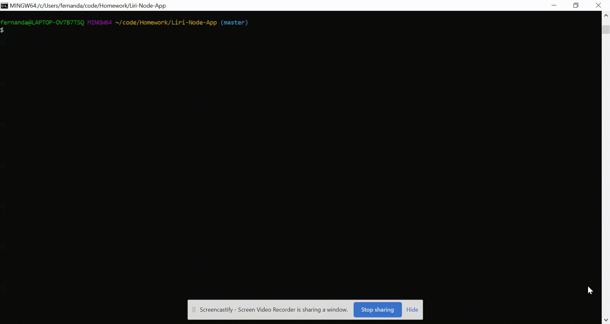

# LIRI Bot

The Language Interpretation and Recognition Interface, also known as **LIRI**, is a command line node app that takes in parameters and gives you back data.

With it, you can search Spotify for songs, Bands in Town for concerts, and OMDB for movies.



**Table of Contents**

- [LIRI Bot](#liri-bot)
  - [Demo](#demo)
  - [Getting Started](#getting-started)
    - [Clone the Repository](#clone-the-repository)
    - [Install Node.js](#install-nodejs)
    - [Install npm packages](#install-npm-packages)
    - [Create .env file](#create-env-file)
    - [Get API keys](#get-api-keys)
  - [How It Works](#how-it-works)
  - [Technologies Used](#technologies-used)

## Demo

Video: https://www.youtube.com/watch?v=0Mr0VsNBRNE

## Getting Started

To get started with LIRI, follow these steps:

### Clone the Repository

Clone this project repository to your local directory on your computer and navigate to it by running the following commands:

```js
git clone git@github.com:fernandamarr/Liri-Node-App.git

cd liri-node-app
```

### Install Node.js

Install [Node.js](https://nodejs.org/en/)

### Install npm packages

The following npm packages are dependencies to the project. Install the packages after navigating to liri-node-app to run LIRI from your command line.

Run this command to install the packages

```js
npm install
```

* [Axios npm package](https://www.npmjs.com/package/axios) - used to grab data from the [OMDB API](http://www.omdbapi.com) and the [Bands In Town API](http://www.artists.bandsintown.com/bandsintown-api)

* [Request npm package](https://www.npmjs.com/package/request)
* [DotEnv npm package](https://www.npmjs.com/package/dotenv)
* [Moment.js npm package](https://www.npmjs.com/package/moment)
* [Spotify npm package](https://www.npmjs.com/package/node-spotify-api)

### Create .env file

Create a file named `.env` and add the following contents, replacing the values with your API keys (no quotes):

```js
# Spotify API keys

SPOTIFY_ID=your-spotify-id
SPOTIFY_SECRET=your-spotify-secret
```

This file will be used by the `dotenv` package to set what are known as environment variables to the global `process.env` object in node. These are values that are meant to be specific to the computer that node is running on, and since we are gitignoring this file, they won't be pushed to github &mdash; keeping the API key information private.

### Get API keys

To run LIRI, obtain the Spotify API keys:

* Go to https://developer.spotify.com/dashboard/login and log-in or create an account.
* Click on **CREATE AN APP**, fill in the required information, and click complete.
* Copy the **Client ID** and **Client Secret** values and paste them in your .env file by replacing the placeholders.

## How It Works

To see LIRI in action, run one of the following 4 commands by using this syntax:

```js
node liri.js command "arguments"
```

| Commands        | What they do                                                                                                                              |
| --------------- | ----------------------------------------------------------------------------------------------------------------------------------------- |
| spotify-this    | Shows song's name, a preview link from Spotify, and the album. If no song is provided, "The Sign" by Ace of Base is displayed as default. |
| movie-this      | Shows movie information. If no movie is typed in, data for the movie 'Mr. Nobody' is displayed as default.                                |
| concert-this    | Search the Bands in Town Artist Events API for an artist and render information about the event.                                          |
| do-what-it-says | Using the `fs` Node package, LIRI will take the text inside of random.txt and then use it to call one of LIRI's commands.                 |

## Technologies Used

* Node.js
* JavaScript