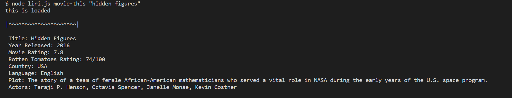

# LIRI Bot

The Language Interpretation and Recognition Interface, also known as LIRI, is a command line node app that takes in parameters and gives you back data.

With it, you can search Spotify for songs, Bands in Town for concerts, and OMDB for movies.



## How It Works

Run one of the following 4 commands:

This command will show the following information about the song in your terminal/bash window:

* Artist(s)
* Song's name
* A preview link of the song from Spotify
* The album that the song is from
* If no song is provided then your program will default to "The Sign" by Ace of Base.

```javascript
node liri.js spotify-this "nice for what"
```

This command will output the following information to your terminal/bash window:

* Title of the movie
* Year the movie came out
* IMDB Rating of the movie
* Rotten Tomatoes Rating of the movie
* Country where the movie was produced
* Language of the movie
* Plot of the movie
* Actors in the movie

```javascript
node liri.js movie-this "coco"
```

This command will search the Bands in Town Artist Events API for an artist and render the following information about each event to the terminal:

* Venue name
* Venue location
* Date of event in MM/DD/YYYY format

```javascript
node liri.js concert-this "jessie reyez"
```

Using the `fs` Node package, LIRI will take the text inside of random.txt and then use it to call one of LIRI's commands:

```javascript
node liri.js do-what-it-says
```